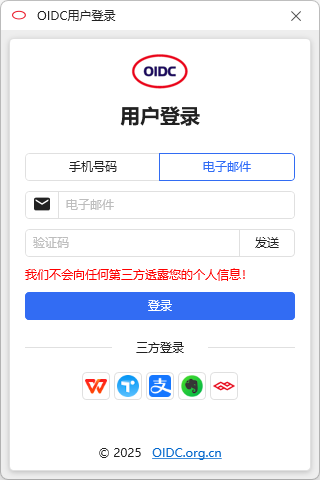
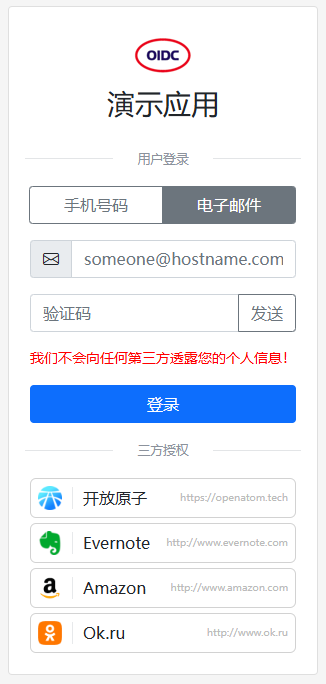

# 📸 截图说明

这个目录包含了 OIDC 联合登录的各种展示效果截图。

## 📷 现有截图

| 截图文件 | 说明 | 预览 |
|----------|------|------|
| `app-login.png` | App端登录界面 | 👇 |
| `web-login.png` | 网页端登录界面 | 👇 |

## 📱 App端登录界面



## 🌐 网页端登录界面



---

## 🎯 如何添加自己的截图

### 1. 运行示例页面

首先运行项目的示例页面：

```bash
# 使用本地服务器（推荐）
http-server . -p 8080

# 或者用其他方式启动服务器
python -m http.server 8080
```

### 2. 访问页面

在浏览器中访问：
- http://localhost:8080/index.html (基础示例)
- http://localhost:8080/vue-example.html (Vue集成示例)

### 3. 截图保存

使用浏览器的截图功能：
- **Windows**: Win + Shift + S
- **Mac**: Cmd + Shift + 4
- **浏览器扩展**: 使用截图扩展工具

### 4. 命名规范

请按照以下规范命名截图：
- `demo-icon.png` - 图标模式展示
- `demo-card.png` - 卡片模式展示
- `demo-list.png` - 列表模式展示
- `vue-demo.png` - Vue组件示例
- `success-page.png` - 登录成功页面
- `custom-theme.png` - 自定义主题效果

### 5. 更新说明

添加截图后，请更新这个 `README.md` 文件，在上面的表格中添加新截图的说明。

---

## 📝 截图使用示例

你可以在文档中这样引用截图：

```markdown
## 卡片模式效果


## 图标模式效果


```

---

## 💡 小贴士

1. **截图尺寸**
   - 建议使用 1920x1080 或类似的高清分辨率
   - 移动端截图建议使用真实设备尺寸

2. **文件格式**
   - 优先使用 PNG 格式（支持透明背景）
   - 如果文件太大，可以使用 JPG 格式

3. **压缩优化**
   - 使用 TinyPNG 等工具压缩图片
   - 保持图片清晰度的同时减小文件大小

---

## 📌 TODO

欢迎贡献更多截图：
- [ ] 图标模式截图
- [ ] 卡片模式截图
- [ ] 列表模式截图
- [ ] Vue 2 示例截图
- [ ] Vue 3 示例截图
- [ ] 自定义主题效果截图
- [ ] 不同浏览器兼容性截图
